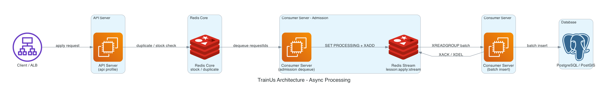
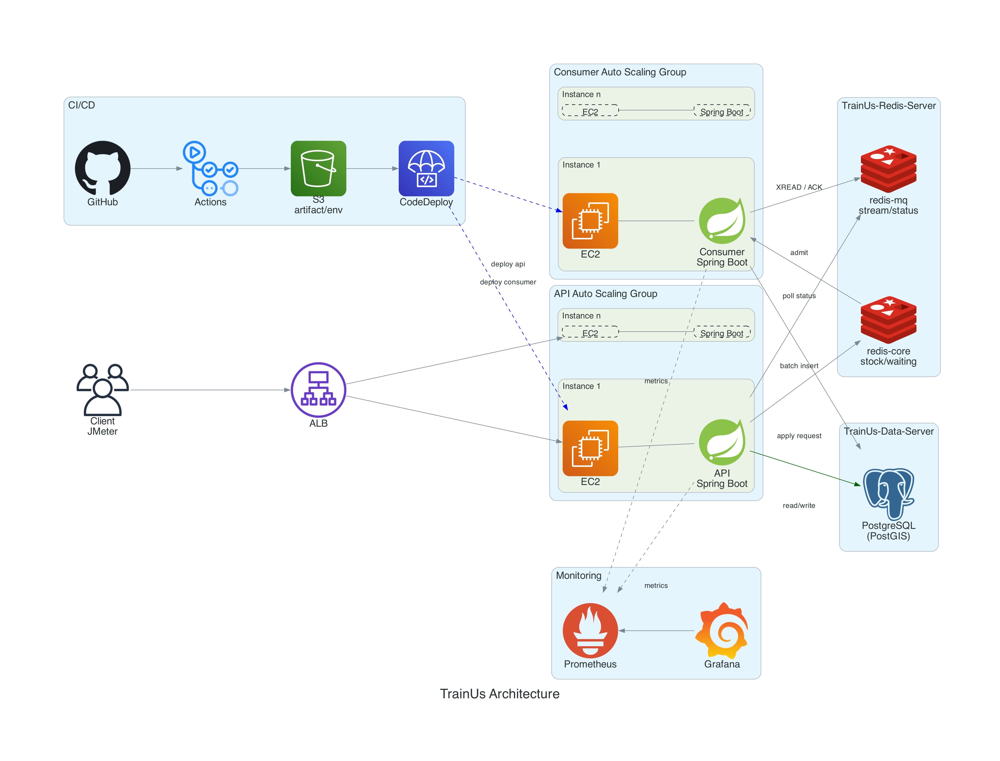

# TrainUs Backend
> 프로그래머스 클라우드 기반 백엔드 데브코스 최종 프로젝트 최우수상 수상 프로젝트

TrainUs는 지역 기반으로 운동 메이트와 트레이너를 찾고 레슨 개설부터 신청, 결제, 리뷰까지 연결하는 운동 클래스 매칭 플랫폼입니다.

## 사용 스택

### Backend


### Database / Cache


### Infra / CI/CD


### Monitoring / Test


## 프로젝트 소개

운동을 꾸준히 하고 싶어도 함께 운동할 사람을 찾기 어렵거나 지역 기반으로 신뢰할 수 있는 트레이너와 레슨을 찾기 어려운 문제가 있습니다.

TrainUs는 사용자가 자신의 지역을 기준으로 운동 메이트 또는 트레이너를 찾고 레슨 개설과 신청, 결제, 후기 작성까지 하나의 흐름으로 이용할 수 있도록 설계한 서비스입니다.

### 주요 목표

- 혼자 하기 어려운 운동을 함께할 운동 메이트를 지역 기반으로 찾을 수 있도록 합니다.
- 축구, 배드민턴 등 다인원 운동의 참여자를 쉽게 모집할 수 있도록 합니다.
- 무료/유료 운동 레슨을 탐색하고 신청할 수 있는 흐름을 제공합니다.
- 리뷰, 평점, 랭킹을 통해 트레이너와 레슨에 대한 신뢰도 판단 기준을 제공합니다.
- 쿠폰과 결제를 통해 유료 레슨 신청 흐름을 확장할 수 있도록 합니다.

### 개선 완료 목표

- 선착순 레슨 신청처럼 순간 트래픽이 몰리는 시나리오를 Redis Stream 기반 비동기 처리 구조로 고도화했습니다.
- 법정동 중심 검색을 사용자 좌표 기반 반경 검색과 가까운 순 정렬까지 확장했습니다.
- API 서버와 Consumer 서버를 분리해 요청 접수와 DB 반영 작업의 리소스 경합을 줄였습니다.

## 팀 구성

| 구분 | 내용 |
| --- | --- |
| 팀명 | 3성 |
| 협업 방식 | WBS 기반 일정 관리, API 명세 공유, Daily Scrum, PR 리뷰, 피어 리뷰어 지정 |

<table>
  <tr>
    <th width="10%"><div align="center">항목</div></th>
    <th width="18%"><div align="center">지민혁</div></th>
    <th width="18%"><div align="center">김태호</div></th>
    <th width="18%"><div align="center">임창인</div></th>
    <th width="18%"><div align="center">김지은</div></th>
    <th width="18%"><div align="center">나상연</div></th>
  </tr>
  <tr align="center">
    <td><strong>프로필</strong></td>
    <td><a href="https://github.com/Ji-minhyeok"></a></td>
    <td><a href="https://github.com/taeho4523"></a></td>
    <td><a href="https://github.com/cba700"></a></td>
    <td><a href="https://github.com/iamjieunkim"></a></td>
    <td><a href="https://github.com/ense333"></a></td>
  </tr>
  <tr align="center">
    <td><strong>역할</strong></td>
    <td>PO, BE</td>
    <td>BE 팀장</td>
    <td>BE</td>
    <td>BE</td>
    <td>BE</td>
  </tr>
  <tr align="center">
    <td><strong>주요 담당 영역</strong></td>
    <td>유저 레슨<br />CI/CD<br />검색/레슨 선착순 고도화</td>
    <td>유저 쿠폰<br />CI/CD<br />쿠폰 선착순 고도화</td>
    <td>로그인/회원가입<br />프로필<br />랭킹</td>
    <td>강사용 레슨<br />관리자 쿠폰</td>
    <td>댓글<br />리뷰<br />Toss Payments 결제</td>
  </tr>
</table>

## 주요 기능

### 회원 및 프로필

- 이메일 인증 기반 회원가입과 로그인
- JWT 기반 인증
- 내 프로필 조회/수정
- 다른 사용자 프로필 조회

### 레슨

- 레슨 생성, 수정, 삭제
- 레슨 상세 조회
- 지역, 키워드, 카테고리 기반 검색
- 개설자가 신청자를 승인/거절하는 수락제 레슨 관리

**고도화/개선 사항:**

- 기존 법정동 기반 검색을 사용자 좌표 기반 반경 검색으로 확장했습니다.
- PostGIS `geography` 타입과 GiST 인덱스를 활용해 반경 검색과 가까운 순 정렬을 지원했습니다.

### 레슨 신청

- 수락제 레슨 신청
- 선착순 레슨 신청
- 비동기 신청 상태 조회
- 내 신청 목록 조회

**고도화/개선 사항:**

- 정원이 제한된 선착순 레슨에 다수의 사용자가 동시에 신청하는 상황을 병목 시나리오로 정의했습니다.
- API 서버는 Redis에서 중복 신청과 재고를 먼저 확인한 뒤 접수 ID를 반환하고 DB 반영은 비동기 처리로 분리했습니다.
- Consumer 서버가 Redis Stream 메시지를 batch 단위로 DB에 반영하고 사용자는 접수 ID로 처리 상태를 조회합니다.



### 결제 및 쿠폰

- Toss Payments 결제 승인/취소
- 쿠폰 발급, 적용, 복원
- 쿠폰 상태 스케줄링

### 커뮤니티

- 댓글/대댓글
- 리뷰와 평점
- 리뷰와 평점 기반 트레이너 랭킹

## 주요 API

| 기능 | Method | Endpoint |
| --- | --- | --- |
| 레슨 검색 | GET | `/api/v1/lessons` |
| 위치 기반 레슨 검색 | GET | `/api/v1/lessons/search/nearby` |
| 레슨 상세 조회 | GET | `/api/v1/lessons/{lessonId}` |
| 수락제 레슨 신청 | POST | `/api/v1/lessons/{lessonId}/applications/approval` |
| 선착순 레슨 신청 | POST | `/api/v1/lessons/{lessonId}/applications/open-run` |
| 비동기 신청 상태 조회 | GET | `/api/v1/lessons/apply/status/{requestId}` |
| 레슨 신청 취소 | DELETE | `/api/v1/lessons/{lessonId}/application` |
| 내 신청 목록 조회 | GET | `/api/v1/lessons/my-applications` |
| 개설 레슨 신청자 조회 | GET | `/api/v1/lessons/{lessonId}/applications` |
| 레슨 신청 승인/거절 | POST | `/api/v1/lessons/applications/{lessonApplicationId}` |
| 랭킹 조회 | GET | `/api/v1/rankings` |
| 결제 승인 | POST | `/api/v1/payments/confirm` |
| S3 업로드 URL 발급 | GET | `/api/v1/s3/posturl` |

Swagger 설정이 포함되어 있어 실행 환경에서 API 문서를 확인할 수 있습니다.

## 시스템 구조



운영 환경에서는 API 서버와 Consumer 서버를 역할별 profile로 분리합니다.

| Role | App Port | Actuator Port | 주요 책임 |
| --- | ---: | ---: | --- |
| `api` | 8080 | 8082 | HTTP 요청 수신, 인증, 레슨 검색, 신청 접수 |
| `consumer` | 8081 | 8083 | Redis Stream 소비, DB 반영, 보정 스케줄링 |

Redis는 목적에 따라 Core Redis와 MQ Redis로 분리해 사용합니다.

| Redis | 기본 포트 | 용도 |
| --- | ---: | --- |
| `redis-core` | 6379 | 재고, 중복 신청, 대기열, 분산 락 |
| `redis-mq` | 6380 | Redis Stream, 신청 처리 상태 |

## 배포 자동화

배포는 GitHub Actions, S3, CodeDeploy를 사용합니다. 
GitHub Actions가 빌드 산출물을 S3에 업로드하고 CodeDeploy가 EC2에서 배포 hook을 실행하는 Pull 방식으로 구성했습니다.

```text
develop push
  -> GitHub Actions build
  -> deploy.zip 생성
  -> S3 업로드
  -> CodeDeploy 배포 생성
  -> EC2에서 appspec hook 실행
```

CodeDeploy hook:

| Script | 역할 |
| --- | --- |
| `scripts/setup.sh` | 배포 디렉터리 준비, S3에서 환경변수 파일 동기화 |
| `scripts/stop.sh` | 기존 애플리케이션 종료 |
| `scripts/start.sh` | 서버 역할에 맞는 Spring profile로 애플리케이션 실행 |

## 협업 방식

- Notion 기반 WBS와 작업 보드로 기능 단위 진행 상황을 관리했습니다.
- API 명세를 공유하며 프론트엔드와 요청/응답 형식을 조율했습니다.
- Git commit convention, code convention, class naming convention을 사전에 정리했습니다.
- PR 리뷰와 피어 리뷰어 지정 방식을 통해 코드 변경 사항을 검토했습니다.
- Daily Scrum과 회의록을 통해 이슈와 의사결정 내용을 기록했습니다.

## 주요 도메인 구조

```text
src/main/java/com/threestar/trainus
  ├── domain
  │   ├── user          # 회원, 이메일 인증
  │   ├── profile       # 프로필
  │   ├── lesson        # 레슨 생성/검색/신청/선착순 처리
  │   ├── coupon        # 쿠폰 생성/발급/사용
  │   ├── payment       # Toss 결제/취소
  │   ├── review        # 리뷰
  │   ├── comment       # 댓글/대댓글
  │   ├── ranking       # 랭킹
  │   └── file          # S3 URL 발급
  └── global
      ├── config        # Security, Redis, S3, Swagger, Scheduler
      ├── resolver      # @LoginUser
      ├── aop           # Redisson distributed lock
      └── exception     # 공통 예외 처리
```
