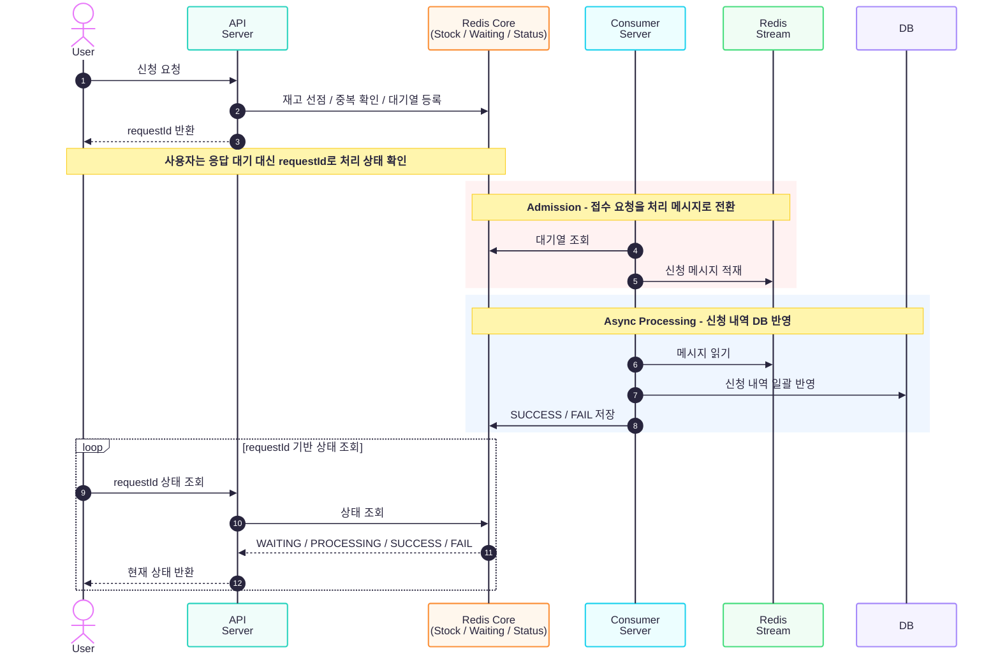

# TrainUs Async Processing Sequence

```mermaid
---
config:
  theme: redux-color
  themeCSS: |
    text.actor {
      font-size: 19px !important;
      font-weight: 600 !important;
    }
    .messageText {
      font-size: 20px !important;
    }
    .noteText {
      font-size: 18px !important;
      font-weight: 600 !important;
    }
    .labelText {
      font-size: 18px !important;
      font-weight: 600 !important;
    }
    .loopText {
      font-size: 18px !important;
      font-weight: 600 !important;
    }
    .note {
      fill: #f8fafc !important;
      stroke: #cbd5e1 !important;
    }
---
sequenceDiagram
    autonumber
    actor User
    participant API as API<br/>Server
    participant Core as Redis Core<br/>(Stock / Waiting / Status)
    participant Consumer as Consumer<br/>Server
    participant Stream as Redis<br/>Stream
    participant DB as DB

    User->>API: 신청 요청
    API->>Core: 재고 선점 / 중복 확인 / 대기열 등록
    API-->>User: requestId 반환

    Note over User,Core: 사용자는 응답 대기 대신 requestId로 처리 상태 확인

    rect rgb(255, 242, 242)
    Note over Core,Stream: Admission - 접수 요청을 처리 메시지로 전환
    Consumer->>Core: 대기열 조회
    Consumer->>Stream: 신청 메시지 적재
    end

    rect rgb(239, 246, 255)
    Note over Core,DB: Async Processing - 신청 내역 DB 반영
    Consumer->>Stream: 메시지 읽기
    Consumer->>DB: 신청 내역 일괄 반영
    Consumer->>Core: SUCCESS / FAIL 저장
    end

    loop requestId 기반 상태 조회
        User->>API: requestId 상태 조회
        API->>Core: 상태 조회
        Core-->>API: WAITING / PROCESSING / SUCCESS / FAIL
        API-->>User: 현재 상태 반환
    end
```
